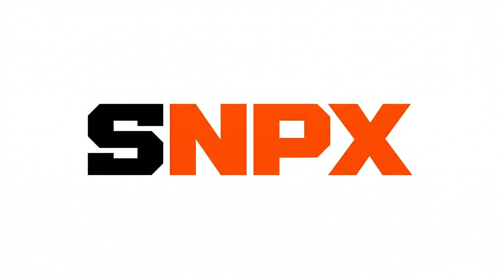

<center>
   
   <p style="margin-top: -4em;"><em><code>snpx -y pkg@latest</code> protects you from newly compromised packages</em></p>
   <br>
   <br>
</center>

## Why / 为什么需要

`npx -y pkg@latest` installs the bleeding edge. If that version was just compromised in a supply chain attack, you get owned immediately. **snpx** intercepts `@latest` (and bare package names) and resolves a safe version based on publish age and a configurable fallback strategy. This gives the security community time to catch malicious releases.

`npx -y pkg@latest` 会直接安装最新版本。如果该版本刚被供应链攻击（Supply Chain Attack）篡改，你会立即中招。**snpx** 会拦截 `@latest`（以及裸包名），根据发布时间和可配置的回退策略（Fallback Strategy）解析出一个安全版本。这为安全社区争取了发现和处置恶意发布的时间窗口。

## Install / 安装

```bash
npm install -g @lionad/safe-npx
```

## Usage / 用法

Drop-in replacement for `npx` — 直接替换 `npx` 即可：

```bash
# Instead of npx -y create-react-app@latest my-app
# 替代 npx -y create-react-app@latest my-app
snpx -y create-react-app@latest my-app

# Works with scoped packages too / 支持带 scope 的包
snpx -y @vue/cli@latest create my-project

# Bare package names are also intercepted / 裸包名同样会被拦截
snpx -y cowsay "Hello World"

# Flags after the package are passed through to the tool / 包名之后的参数会透传给被执行的工具
snpx cowsay@latest --version
```

## How it works / 工作原理

1. Intercepts calls containing `@latest` and bare package names / 拦截包含 `@latest` 和裸包名的调用
2. Queries npm registry for the package / 查询 npm registry 获取包信息
3. If `latest` is older than the safety window (default 24h), uses `latest` / 如果 `latest` 发布时间超过安全窗口（默认 24 小时），直接使用
4. Otherwise, falls back through the configured strategy / 否则，按配置的策略依次回退：
   - `patch` = version published immediately before `latest` / 发布时间紧邻 `latest` 之前的版本
   - `minor` = most recently published version of the previous minor line / 上一个 minor 线最近发布的版本
   - `major` = most recently published version of the previous major line / 上一个 major 线最近发布的版本
5. Verifies the fallback version is also older than the safety window / 验证回退版本也超过安全窗口
6. Caches the resolved version for the duration of the safety window / 在安全窗口期间缓存解析结果
7. Executes `npx pkg@resolved_version ...` / 执行 `npx pkg@resolved_version ...`

## Options / 选项

```bash
# Configure safety window (hours) / 配置安全窗口（小时）
snpx --time 48 cowsay@latest

# Configure fallback strategy (left-to-right precedence) / 配置回退策略（从左到右优先）
snpx --fallback-strategy patch,minor,major cowsay@latest

# Print resolved version without executing / 打印解析到的版本但不执行
snpx --show-version cowsay@latest

# Check for snpx updates (safe mode - respects 24h window) / 检查 snpx 自身更新（安全模式，遵守 24 小时窗口）
snpx --self-update

# Bypass safety window for self-update check (not recommended) / 跳过安全窗口检查更新（不推荐）
snpx --unsafe-self-update

# Show help / 显示帮助
snpx --help
```

## Environment Variables / 环境变量

- `SNPX_TIME` — Default for `--time` / `--time` 的默认值
- `SNPX_FALLBACK_STRATEGY` — Default for `--fallback-strategy` / `--fallback-strategy` 的默认值

## Cache / 缓存

Resolved versions are cached in `~/.cache/snpx/` for the duration of the safety window (default 24 hours). This means:
- Fast subsequent runs (no registry requests) / 后续运行更快（无需请求 registry）
- At most one registry query per package per window / 每个安全窗口内每个包最多一次 registry 查询

## Acknowledgments / 致谢

Inspired by [safe-npm](https://github.com/kevinslin/safe-npm) by Kevin Lin.

灵感来自 Kevin Lin 的 [safe-npm](https://github.com/kevinslin/safe-npm)。

## License

MIT
